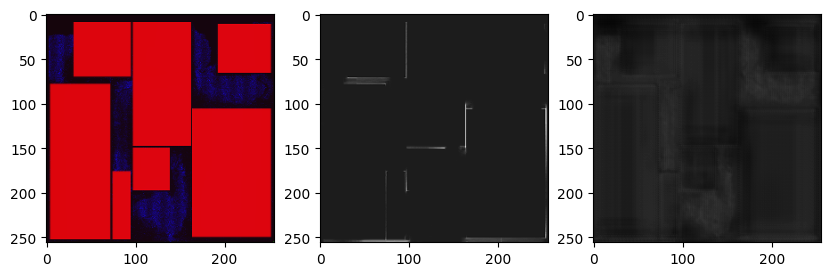

# AI-Assisted Routability-Driven Placement 报告

## 代码仓库
https://github.com/kix6lj/DREAMPlace/tree/submit

## 实现
### ML Model
直接使用CircuitNet中提供的RouteNet，训练使用的Loss function为MSELoss，batch大小为16，训练20000 iteration。训练使用的数据为CircuitNet中的训练集以及ISPD contest中的11个design（提供的默认生成训练集的脚本中生成label的方式是对horizontal congestion和vertical congestion取min，与CircuitNet数据生成的脚本不同，所以改成了求和）。

模型最终在训练集上的Loss为0.2917，在测试集上的平均Loss为0.2913。

RouteNet的效果如下图所示，左图为输入的feature map，中间为ground truth，右图为预测结果，在这个实例上，预测的MSE误差为0.23.

### DREAMPlace集成
集成进入DREAMPlace中时，使用DREAMPlace提供的density_map_op, rudy_utilization_map_op, pinrudy_utilization_map_op生成输入的feature，将得到的overflow map所有位置加1做为congestion map. Cell inflation使用默认参数，即 $max(congestion^{2.5}, 2.5)$

### 实验结果

最终的实验结果如表所示，每一个数据点为$(Cong, SHPWL)$，上面的是实现了routability optimization的结果，下面的是没有实现的结果。在4个hidden test上，实现了routability optimization之后并没有在SHPWL上取得更好的结果，主要原因是HPWL更大了，比如在`mgc_superblue12`上面，使用routability optimization之后可以将congestion score降低2左右，但是由于HPWL更大，跟$Cong$的基数100乘起来占SHPWL的主要部分，所以在SHPWL会比不用routability optimization($Cong$更高，但是HPWL更小)要差。

| Benchmark          | HPWL                     | $0.5\%$                                        | $1\%$                                          | $2\%$                                           | $5\%$                                          |
| ------------------ | ------------------------ | ---------------------------------------------- | ---------------------------------------------- | ----------------------------------------------- | ---------------------------------------------- |
| mgc_matrix_mult_c  | 1.568E+07   1.528E+07 | (121.209, 5.717E+09)   (121.337, 5.579E+09) | (120.011, 5.661E+09)   (120.178, 5.526E+09) | (119.049, 5.615E+09)   (119.239, 5.482E+09)  | (117.922, 5.562E+09)   (118.100, 5.430E+09) |                            
| mgc_pci_bridge32_b | 3.349E+06   3.176E+06 | (117.562, 1.184E+09)   (117.332, 1.121E+09) | (116.919, 1.178E+09)   (116.736, 1.115E+09) | (116.183, 1.170E+09)   (116.042, 1.109E+09)  | (115.317, 1.162E+09)   (115.259, 1.101E+09) |                              
| mgc_superblue12    | 2.673E+08   2.572E+08 | (129.854, 1.044E+11)   (132.478, 1.024E+11) | (128.161, 1.030E+11)   (130.500, 1.009E+11) | (126.227, 1.0149E+11)   (128.058, 9.908E+10) | (123.321, 9.915E+10)   (124.217, 9.611E+10) |                           
| mgc_superblue16_a  | 2.674E+08   2.684E+08 | (123.704, 9.948E+10)   (123.738, 9.989E+10) | (120.838, 9.719E+10)   (120.846, 9.756E+10) | (118.373, 9.521E+10)   (118.392, 9.559E+10)  | (116.322, 9.356E+10)   (116.336, 9.393E+10) |